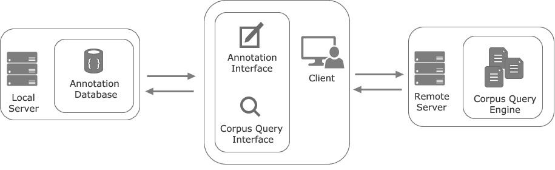
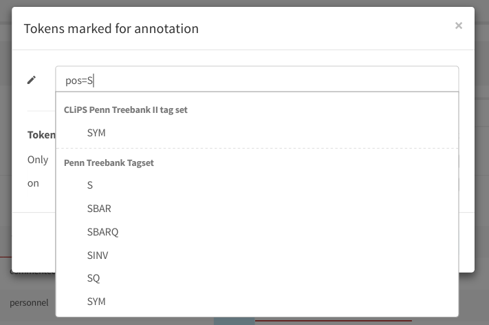

# Cosycat (Collaborative Synchronized Corpus Annotation Tool)

## Introduction

Cosycat is a web-based corpus query and annotation interface with a focus on
multiuser **synchronization** and **version control**. The application is designed 
with an emphasis on **modularity** and **reusability**.

[a beautiful screenshot here]

### What can I do with Cosycat?

The major goal of Cosycat is to enable synchronized multiuser annotation of corpora.
While Cosycat can absolutely be used for annotating typical NLP resources (such as
Part-of-Speech tagging a newspaper corpus), it is mostly geared towards (preferrably
team-based) Corpus Linguistic research aimed at statistically analyzing 
particular constructions that have to be first retrieved and annotated.

Cosycat allows multiple users to analyze the same corpus in an interactive way,
keeping their annotations synchronized with each other and receiving live feedback
from each other actions. Each change to the current body of corpus annotations 
(e.g. each time an annotation is introduced, modified or removed by a user) is
recorded in a version control fashion which allows to easily backtrace the annotation
history.

### How does it work?

Cosycat is built taking advantage of modern browser features such as WebSockets or LocalStorage,
recent developments in reactive UI programming (see the React framework), as well as the
flexibility of NoSQL databases.

1.  Architecture

    Cosycat follows the following client-server architecture:
    
	<p align="center"></p>
    
    The client interacts with the local annotation database and with the (possibly) remote server
    via HTTP. This gives you the advantage of not having to host corpus yourself (although, this
    is certainly possible).

2.  User interaction

    User activity is routed through the server and then propagated to the rest endpoints (users)
    that are currently using the application. Cosycat informs users of each others activities using
    a built-in notification system.

3.  Projects (access rights, pub/sub notifications)

    A central organizatory piece of Cosycat is the "project". Projects serve multiple purposes:
    
    -   Control notification verbosity (subscribing/unsubscribing from projects)
    -   Grouping annotations into different
    -   Advanced: (delayed merge) use projects as local working copies.

4.  Version Control

    Currently, Cosycat allows you to keep track of all changes effected over the annotation database.
    This is done with a [small module](https://github.com/emanjavacas/cosycat/blob/master/src/clj/cosycat/vcs.clj),
	that stores changes to a MongoDB document in a version-controlled
    collection using a traditional lock system for data consistency.

## Installation

Cosycat is written in [Clojure](https://github.com/clojure/clojure)/[Clojurescript](https://github.com/clojure/clojurescript) - a nested Lisp dialect implemented on top of Java/Javascript.
From the outside, Cosycat is just a Java application, which means that in order to run it you will need 
the Java Virtual Machine (JVM). 

### Java

Chances are high that you already have Java installed in your system. If not, you can either install
the JRE (Java Runtime Environment) or the JDK (Java Development Kit).

In Ubuntu, depending on which package you want you can do the following (select either jre or jdk).

```sh
sudo apt-get install default-jre/default-jdk
```

For Mac you can use `homebrew` and do

```sh
brew cask install java
```

and you should be done.


### External dependencies

Before you can run the app executable you need to make sure the following external dependencies
are installed and running on your system.

1.  MongoDb

    Perhaps the most important dependency is the MongoDB database. 
    The official online documentation has a nice section on [how to install MongoDB](https://docs.mongodb.com/manual/installation/#mongodb-community-edition) in different OSs.
    Once you have a working installation of MongoDB, make sure it is running before deploying Cosycat.
    Most conveniently, you can run the MongoDB process in the background as a daemon (see
    [Start `mongod` as a Daemon](https://docs.mongodb.com/manual/tutorial/manage-mongodb-processes/#start-mongod-as-a-daemon) for instructions). The `mongod` process will listen on specific
    TCP port, which defaults to 27017 but can be changed to any other value using the `--port` optional
    argument.

2.  Corpus Query Engines

    In order to provide Cosycat with search capabilities you to point it to a server running
    an instance of a corpus query engine. Cosycat relies on HTTP to access corpus resources
    through a corpus query engine. Which means that your corpus query engine has to be deployable
    as a server application and has to know how to provide results on response to HTTP GET requests.
    In some cases - such as [BlackLab](https://github.com/INL/BlackLab) -,
	a server implementation is already provided
	(see [here](http://inl.github.io/BlackLab/blacklab-server-overview.html)).
    For the rest, it is normally easy to wrap a query engine in a HTTP server provided the engine
    can be interacted with from a powerful enough programming language.
    For instance, an example of a very simple server wrapper for the CQP engine can be found 
	[here](https://www.github.com/emanjavacas/simple-cwb-server)
    (note, however, that it is still very alpha).
    
    As of Cosycat's current version, only the BlackLab server is supported.
    However adding support for other query engines is trivial and we will happily offer help
    or, perhaps, implement it ourselves if you let us know about the details (by, for instance,
    opening an issue to this repository).
    See further down for documentation on how to implement support for a new query engine.

### Configuration

In order to run Cosycat you need to point it to the corpora you want to make available
and to the the database connection (in case you are running MongoDB on a non-default port).
Additionally, there are other optional variables that can be set or customize.
All configuration should go into a file in [edn format](https://en.wikipedia.org/wiki/Extensible_Data_Notation)
such as the following
(documentation for each variable is shown in place as comments).

```clojure
{:dynamic-resource-path "app-resources/"            ;where to store dynamic resources (logs, etc...)
 :avatar-path "img/avatars/"                        ;where to store generated avatars
 :tagset-paths ["/dir/with/tagsets" "another/path"] ;paths with tagset json files
 :database-url "mongodb://127.0.0.1:27017/cosycat"  ;mongodb URL (do not change unless you run mongod on a different port)
 :pass "pass"                                       ;admin password
 :port 3000                                         ;port to serve the website on
 :session-expires 900                               ;in minutes
 :corpora [... see below ...]}
```

#### Corpus configuration

There are several formats for specifying corpora.
    
- Corpora full format. Specifies corpus, endpoint type and the corpus options needed by that type.
       
```clojure
[{:corpus "brown-tei"
  :type :blacklab-server
  :args {:server "my-server.com:8080"
  :web-service "blacklab-server-1.4-SNAPSHOT"}}]
```
    
- Corpora short format. Require all corpora available at a given URL (composed of <http://server/webservice>).
       
```clojure
[{:type :blacklab-server
  :server "my-server.com:8080"
  :web-service "blacklab-server-1.4-SNAPSHOT"}]
```
	
- Include only specific corpora from a given domain (TODO)
        
```clojure
[{:type :blacklab-server
  :server "my-server.com:8080"
  :web-service "blacklab-server-1.4-SNAPSHOT"
  :args {:corpora ["brown-tei"]}}]
```

### Running the app

Once you have resolved the dependencies and created your configuration file you only need to grab
the application from the release page.


> Aditionally you can choose to **build the executable** yourself.
> If you want to build the jar file yourself, you will need the handy Clojure project manager
> [Leiningen](http://leiningen.org/) (see link for further installation instructions).
> Once you have installed leiningen you need to fetch the sourcecode from this repository:
    
> ```sh
> git clone https://www.github.com/emanjavacas/cosycat.git
> ```
    
> Go to the project root directory:
    
> ```sh
> cd cosycat
> ```
    
> and call the `uberjar` action:
    
> ```bash
> lein uberjar
> ```
    
> This last command will download all dependencies and build the executable jar into
> `cosycat/target/cosycat-VERSION-standalone.jar`, which you can use to run the app.

In order to start the application, you only need the following command.

```sh
java -Dconfig="path/to/config.edn" -jar cleebo-VERSION.jar start
```

Afterwards you should be able to navigate through your browser to your server's URL plus
the port specified in the `config.edn` file (or `localhost:PORT` if you are running the 
application locally) and see Cosycat's landing page.

#### Tagsets

When doing annotations, it is common to predefine a set of annotation keys and values that
have to be used for a given research question. For instance, if you want to annotate parts
of speech (POS), you want to make sure the research team follows the same standard, such as
the Penn Treebank tagset, or similar.

Furthermore, knowing the tagset allows the application to provide you with autocomplete
functionalities - as shown in the picture below -, which can save your team a lot of typing time.

<p align="center"></p>
		
Cosycat allows you to input different tagsets using a simple tagset format.
See the following
[JSON file](https://github.com/emanjavacas/cosycat/tree/master/resources/public/tagsets/pennTreebank.json)
for an example.
You can specify as many JSON tagset files as you want.
In order for Cosycat to use the tagsets, you only need to add directories with
tagsets to your config file (see above).

## TODO Contributing

### Adding support for a new Corpus Query Engine

## TODO List

- Bulk inserts (does this work atomically in MongoDB?).

- Span annotations always touch multiple documents (from B to O). In that case, we should try
  `$isolated` to ensure atomic updates, 
  see [atomicity](https://docs.mongodb.org/manual/core/write-operations-atomicity/) and
  [$isolated operator](https://docs.mongodb.org/manual/reference/operator/update/isolated/#up._S_isolated).

## License

Cosycat is released with a [GPL v.3.](https://www.gnu.org/licenses/gpl-3.0.html) license.
